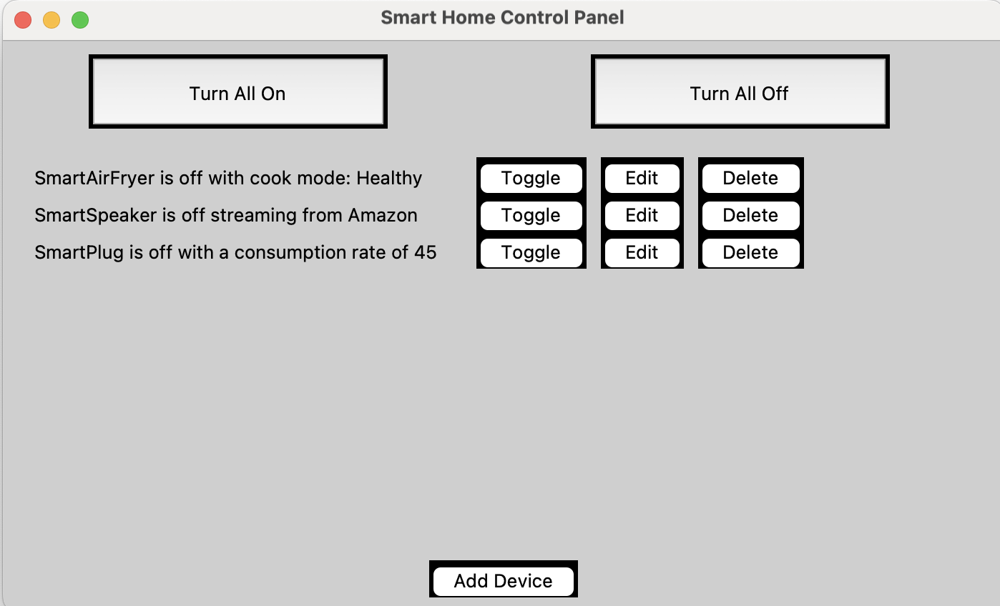
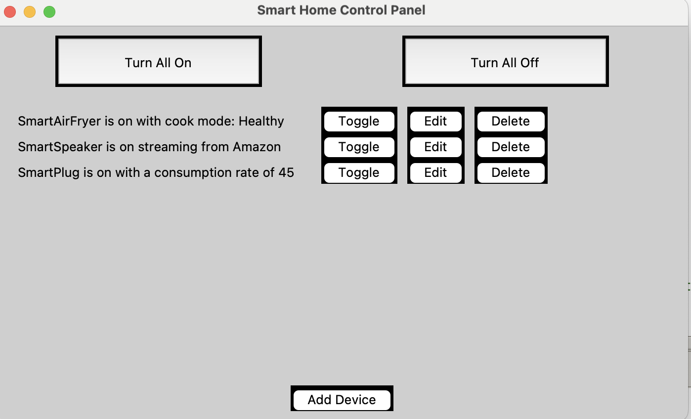
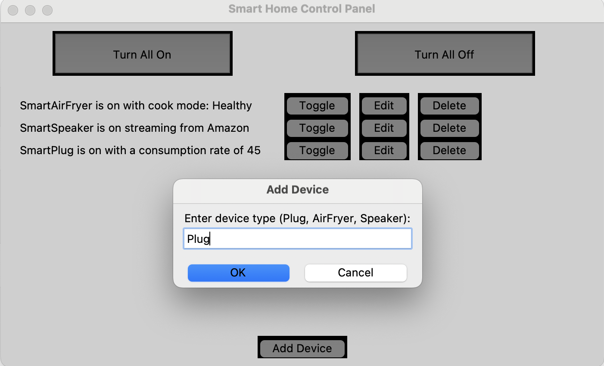

# Smart Home Control App

## Project Overview

This project simulates a smart home management system where users can control and manage multiple smart devices through a graphical user interface (GUI). The application was developed as part of a first-year university programming module to demonstrate object-oriented programming concepts and GUI development using Python and Tkinter.

This is a first-year university programming project built with Python and Tkinter.

## Features

- Manage multiple smart devices
- Smart Plug with configurable power consumption
- Smart Air Fryer with multiple cooking modes
- Smart Speaker with selectable streaming services
- Add and remove devices dynamically
- Toggle individual devices on or off
- Switch all devices on or off simultaneously
- Edit device settings through the GUI

## Technologies Used

- Python
- Tkinter
- Object-Oriented Programming

## Screenshots

### Main Window



### Devices on



### add_device



## Project Structure

```text
smart-home-control-app/
│
├── screenshots/
│   ├── main_window.png
│   └── devices_on.png
├── README.md
├── requirements.txt
└── smart_home_app.py
```

## What I Learned

Through this project I gained experience with:

- Object-Oriented Programming (OOP)
- Inheritance and encapsulation
- Python class design
- Input validation and error handling
- GUI development using Tkinter
- Managing collections of objects

## Author

Roxana Esmaeili
